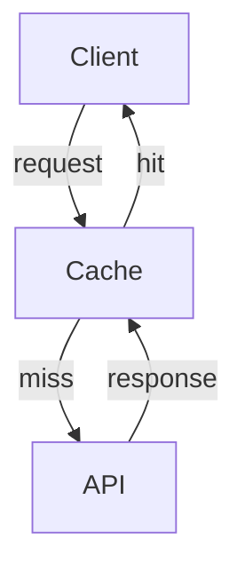

# Performance Optimization

Optimize your Acme SDK usage for best performance.



Enable built-in caching to reduce API calls:

```javascript
const client = new Acme({
  cache: {
    enabled: true,
    ttl: 300, // 5 minutes
  },
});
```


Batch multiple requests together:

```javascript
const results = await client.batch([
  client.projects.get("p1"),
  client.projects.get("p2"),
  client.projects.get("p3"),
]);
```




With caching enabled, most read operations see a 10x performance improvement.


<details>
<summary>Benchmark Results</summary>

| Operation | Without Cache | With Cache |
|-----------|--------------|------------|
| Get Project | 120ms | 2ms |
| List Pages | 350ms | 5ms |
| Search | 500ms | 50ms |

</details>

## Architecture


