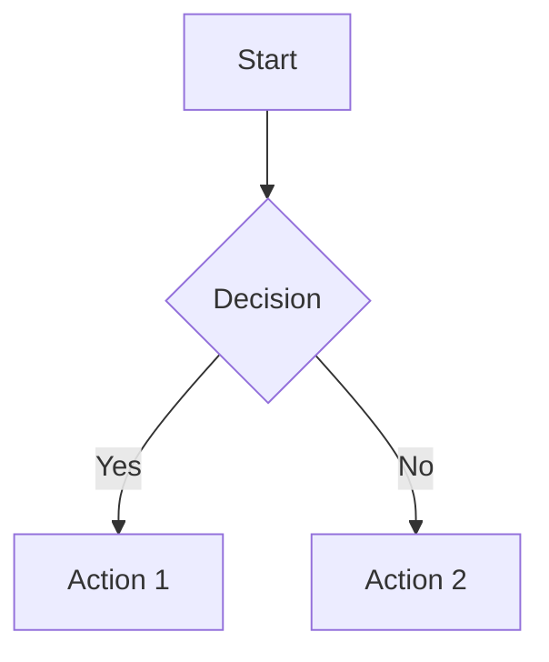

# InkLoom

Create, manage, and deploy documentation sites on the InkLoom platform.

## What is InkLoom

InkLoom is an AI-powered documentation platform for developer teams. It combines a rich block editor, a full-featured CLI, GitHub sync, and edge deployment on Cloudflare Pages.

**Key capabilities:** block editor with 24+ MDX components · full CLI & REST API · AI doc generation from codebases · bidirectional GitHub sync · 9 themes with dark mode · edge deployment on Cloudflare · OpenAPI playground

The platform has free, Pro, and Enterprise tiers. CLI/API access requires **Pro or above**.

## Core Workflow

The end-to-end flow for creating and deploying documentation via the CLI:

### 1. Install the CLI

```bash
npm install -g @inkloom/cli
```

Requires Node.js 20+. Verify with `inkloom --version`.

### 2. Authenticate

Create an API key in the InkLoom dashboard (**Settings → API Keys**), then:

```bash
inkloom auth login --token ik_live_user_...
```

Without `--token`, the CLI prompts interactively. Verify with `inkloom auth status`.

### 3. Create a project

```bash
inkloom projects create --name "My API Docs"
# Returns a project ID (e.g., prj_abc123) — save this
```

### 4. Write MDX pages locally

Create a `docs/` directory. Each `.mdx` file is a page; subdirectories map to folders:

```
docs/
├── getting-started.mdx
├── guides/
│   ├── authentication.mdx
│   └── pagination.mdx
└── api-reference/
    └── endpoints.mdx
```

Every MDX file needs YAML frontmatter (see **MDX Page Format** below).

### 5. Push to InkLoom

```bash
# Preview what will change
inkloom pages push <projectId> --dir ./docs --dry-run

# Push for real — --publish marks pages as published
inkloom pages push <projectId> --dir ./docs --publish
```

### 6. Deploy

```bash
inkloom deploy <projectId> --production --wait
```

Your docs are live on Cloudflare's edge network within seconds.

### 7. Iterate

Pull remote changes, edit locally, push again:

```bash
inkloom pages pull <projectId> --dir ./docs
# Edit files...
inkloom pages push <projectId> --dir ./docs --publish
inkloom deploy <projectId> --production --wait
```

## Essential CLI Commands

The 8 most-used command groups. All commands accept `--json` for machine-readable output and `-v` for debug logging.

| Group | Command | Description |
|-------|---------|-------------|
| **Auth** | `inkloom auth login [--token <key>]` | Authenticate with API key |
| | `inkloom auth status` | Verify authentication |
| | `inkloom auth logout` | Remove stored credentials |
| **Projects** | `inkloom projects list` | List accessible projects |
| | `inkloom projects create --name <n>` | Create a new project |
| | `inkloom projects get <id>` | Get project details |
| | `inkloom projects delete <id>` | Delete a project |
| **Pages** | `inkloom pages push <projId> --dir <d>` | Sync local MDX files to project |
| | `inkloom pages pull <projId> --dir <d>` | Export pages as local MDX files |
| | `inkloom pages list --project <id>` | List pages in a project |
| | `inkloom pages create --project <id> --file <f>` | Create a single page |
| | `inkloom pages update <pageId> --file <f>` | Update a single page |
| | `inkloom pages publish <pageId>` | Publish a draft page |
| **Folders** | `inkloom folders list --project <id>` | List folders |
| | `inkloom folders create --project <id> --name <n>` | Create a folder |
| | `inkloom folders delete <folderId>` | Delete a folder recursively |
| **Deploy** | `inkloom deploy <projId> [--production] [--wait]` | Trigger deployment |
| **Deployments** | `inkloom deployments list --project <id>` | List deployments |
| | `inkloom deployments status <deplId>` | Check deployment status |
| | `inkloom deployments rollback <deplId>` | Rollback to previous deploy |
| **Branches** | `inkloom branches list --project <id>` | List branches |
| | `inkloom branches create --project <id> --name <n>` | Create a branch |
| | `inkloom branches delete <branchId>` | Delete a branch |
| **Build** | `inkloom build <projId> [--output <dir>]` | Generate static site locally |

**Environment variables** (override config file, useful for CI):

| Variable | Description |
|----------|-------------|
| `INKLOOM_TOKEN` | API key |
| `INKLOOM_ORG_ID` | Organization ID |
| `INKLOOM_API_URL` | API base URL (default: `https://inkloom.io`) |

> For the full command reference including domains, assets, OpenAPI, webhooks, llms.txt, export, and migrate commands, see [references/cli-reference.md](references/cli-reference.md).

## MDX Page Format

Every `.mdx` file starts with YAML frontmatter:

```yaml
---
title: Getting Started
description: Learn how to use our API
icon: rocket
slug: getting-started
position: 0
isPublished: true
---
```

| Field | Required | Type | Description |
|-------|----------|------|-------------|
| `title` | Yes | string | Page title (navigation and `<title>` tag) |
| `description` | Yes | string | Brief description (meta tags, navigation) |
| `icon` | Yes | string | Lucide icon name (e.g., `rocket`, `terminal`) |
| `slug` | No | string | URL slug (defaults to filename) |
| `position` | No | number | Sort order within folder (0-based) |
| `isPublished` | No | boolean | Published or draft (default: false) |

After the frontmatter, write standard Markdown (GFM) plus InkLoom's built-in MDX components.

## Core MDX Components

All components are globally available — **no imports needed**. These 12 cover most documentation needs.

### Callout

Highlighted info boxes. Types: `info`, `warning`, `danger`, `success`, `tip`, `note`, `caution`.

```mdx
<Callout type="info">
Informational message here.
</Callout>

<Callout type="warning" title="Breaking Change">
This endpoint is removed in v3.0.
</Callout>
```

### Steps / Step

Sequential numbered instructions. Steps support optional `icon` attribute.

```mdx
<Steps>
<Step title="Install dependencies">
Run `npm install` to install all packages.
</Step>

<Step title="Configure" icon="lucide:settings">
Create a `config.yaml` with your settings.
</Step>
</Steps>
```

### Tabs / Tab

Switchable content panels. Tabs support optional `icon` attribute.

```mdx
<Tabs>
<Tab title="npm">
```bash
npm install my-package
```
</Tab>

<Tab title="yarn">
```bash
yarn add my-package
```
</Tab>
</Tabs>
```

### Card / CardGroup

Navigation cards with icon and link. Group in a grid with `cols` (2, 3, or 4).

```mdx
<CardGroup cols={2}>
<Card title="API Reference" icon="lucide:code" href="/api">
Explore the REST API.
</Card>
<Card title="CLI Guide" icon="lucide:terminal" href="/cli">
Command-line reference.
</Card>
</CardGroup>
```

### CodeGroup

Tabbed code blocks — show the same concept in multiple languages:

````mdx
<CodeGroup>
```typescript title="Node.js"
const res = await fetch('/api/data');
```

```python title="Python"
res = requests.get('/api/data')
```
</CodeGroup>
````

### Accordion / AccordionGroup

Collapsible content sections. Use `defaultOpen` to expand by default.

```mdx
<AccordionGroup>
<Accordion title="What formats are supported?" defaultOpen>
InkLoom supports MDX, Markdown, and rich text.
</Accordion>

<Accordion title="Can I use custom components?">
InkLoom provides 24+ built-in components.
</Accordion>
</AccordionGroup>
```

### Frame

Bordered container for images/screenshots with optional caption.

```mdx
<Frame caption="Project dashboard">


</Frame>
```

### Columns / Column

Multi-column layouts:

```mdx
<Columns>
<Column>
**Left column** — content here.
</Column>

<Column>
**Right column** — content here.
</Column>
</Columns>
```

### Code Block Metadata

Standard fenced code blocks support title and height:

````markdown
```python title="example.py"
def hello():
    print("Hello!")
```

```json {height=200}
{ "key": "value" }
```
````

### Expandable

Expandable sections, commonly used for API response details:

```mdx
<Expandable title="Response fields">
- `id` (string) — unique identifier
- `name` (string) — display name
- `created_at` (string) — ISO 8601 timestamp
</Expandable>
```

### ParamField

API parameter documentation:

```mdx
<ParamField name="api_key" type="string" required>
Your API key. Find in **Settings → API Keys**.
</ParamField>

<ParamField name="limit" type="integer" default="20">
Max results to return (1–100).
</ParamField>
```

### ResponseField

API response field documentation:

```mdx
<ResponseField name="data" type="array">
An array of user objects.
</ResponseField>
```

> For all 24 components including Image, Video, iframe, and more, see [references/mdx-components.md](references/mdx-components.md).

## Inline Elements

### Icon

Insert Lucide icons inline. Format: `lucide:<icon-name>`.

```mdx
<Icon name="lucide:rocket" /> Launch your docs
```

### Badge

Inline highlighted labels with optional color:

```mdx
<Badge>Beta</Badge>
<Badge color="green">Stable</Badge>
```

### LaTeX

Inline and block math expressions:

```mdx
Inline: $E = mc^2$

Block:
$$
\sum_{i=1}^{n} x_i = x_1 + x_2 + \cdots + x_n
$$
```

### Mermaid

Diagrams via Mermaid syntax in fenced code blocks (auto-adapts to light/dark theme):

````markdown

````

## MDX Authoring Tips

**No imports needed.** All components are globally available. Never add `import` statements.

**Icon format:** Use `lucide:<name>` for icon attributes (e.g., `icon="lucide:rocket"`). In frontmatter, use just the name (e.g., `icon: rocket`). Icons come from the [Lucide](https://lucide.dev/icons) icon set.

**Nesting patterns:**
- `<Steps>` must contain `<Step>` children
- `<Tabs>` must contain `<Tab>` children
- `<CardGroup>` must contain `<Card>` children
- `<AccordionGroup>` must contain `<Accordion>` children
- `<Columns>` must contain `<Column>` children
- `<CodeGroup>` must contain fenced code blocks

**Blank lines around content:** Always leave a blank line after an opening component tag and before a closing tag when the content contains Markdown:

```mdx
<Callout type="info">

This Markdown **renders correctly** because of the blank lines.

</Callout>
```

**Common mistakes to avoid:**
- Do not use `import` statements — components are global
- Do not use `<br />` — use blank lines for spacing
- Do not forget frontmatter — every page needs `title`, `description`, and `icon`
- Do not nest `<Steps>` inside `<Steps>` — use separate step groups
- Do not use HTML `<table>` — use Markdown tables instead
- Do not mix `<Tabs>` and `<CodeGroup>` — use one or the other

## Platform & Sign-Up

### Getting started

1. Sign up at [inkloom.io](https://inkloom.io) — free tier available
2. Create a project from the dashboard or CLI
3. Generate an API key in **Settings → API Keys** (requires Pro plan for CLI/API access)

### Plans

| Tier | CLI/API | Key features |
|------|---------|--------------|
| **Free** | No | Block editor, 1 project, community themes |
| **Pro** | Yes | CLI, API, GitHub sync, custom domains, all themes, AI generation |
| **Enterprise** | Yes | SSO, audit logs, SLA, dedicated support, unlimited projects |

### API keys

- Created in dashboard: **Settings → API Keys**
- Format: `ik_live_user_...`
- Store securely — treat as a secret
- Use `INKLOOM_TOKEN` env var in CI/CD environments

> For full platform details including organizations, custom domains, themes, and the block editor, see [references/platform-guide.md](references/platform-guide.md).

## CI/CD Quick Setup

Automate documentation deploys with GitHub Actions:

```yaml
name: Deploy Docs
on:
  push:
    branches: [main]
    paths: ['docs/**']

jobs:
  deploy:
    runs-on: ubuntu-latest
    steps:
      - uses: actions/checkout@v4

      - uses: actions/setup-node@v4
        with:
          node-version: '20'

      - run: npm install -g @inkloom/cli

      - run: inkloom pages push ${{ secrets.INKLOOM_PROJECT_ID }} --dir ./docs --publish
        env:
          INKLOOM_TOKEN: ${{ secrets.INKLOOM_TOKEN }}

      - run: inkloom deploy ${{ secrets.INKLOOM_PROJECT_ID }} --production --wait
        env:
          INKLOOM_TOKEN: ${{ secrets.INKLOOM_TOKEN }}
```

**Required secrets:**

| Secret | Description |
|--------|-------------|
| `INKLOOM_TOKEN` | API key (`ik_live_user_...`) |
| `INKLOOM_PROJECT_ID` | Project ID (`prj_...`) |

> For advanced CI/CD patterns (branch previews, multi-project setups, other CI providers), see [references/cicd-integration.md](references/cicd-integration.md).

## Available Resources

This skill includes additional reference files for deep dives:

- **[references/cli-reference.md](references/cli-reference.md)** — Full CLI command reference with all flags and options
- **[references/mdx-components.md](references/mdx-components.md)** — Complete reference for all 24 MDX components
- **[references/platform-guide.md](references/platform-guide.md)** — Platform features, organizations, themes, domains, editor
- **[references/cicd-integration.md](references/cicd-integration.md)** — CI/CD patterns for GitHub Actions, GitLab CI, and other providers

Helper scripts and static assets are in the `scripts/` and `assets/` directories.
