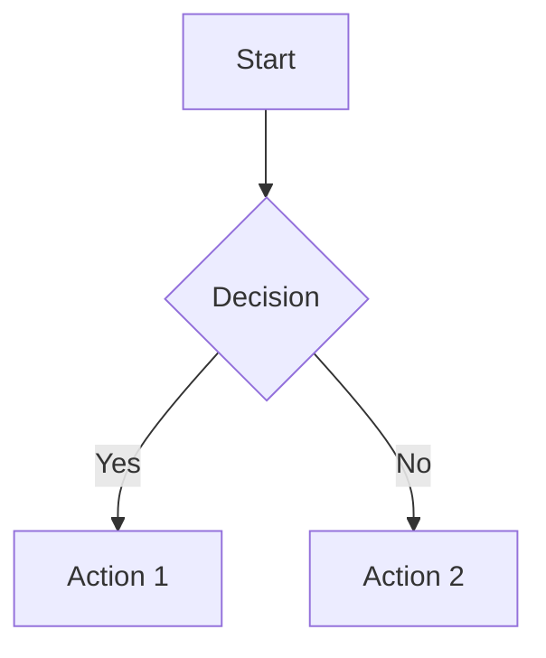

# MDX Components Reference

Complete reference for all InkLoom MDX components. Components are globally available — no imports needed.

## Callout

Highlighted box for notes, warnings, and tips.

| Attribute | Type | Required | Default | Description |
|-----------|------|----------|---------|-------------|
| `type` | `"info" \| "warning" \| "danger" \| "success" \| "tip"` | No | `"info"` | Visual style and icon |
| `title` | `string` | No | — | Custom title (overrides type label) |

```mdx
<Callout type="warning" title="Breaking Change">
This endpoint is removed in v3.0.
</Callout>
```

## Tabs / Tab

Switchable content panels for alternatives (languages, platforms). **Tabs** is a wrapper with no attributes.

**Tab**:

| Attribute | Type | Required | Default | Description |
|-----------|------|----------|---------|-------------|
| `title` | `string` | Yes | — | Tab label |
| `icon` | `string` | No | — | Lucide icon (e.g. `"lucide:package"`) |

```mdx
<Tabs>
<Tab title="npm">npm install my-package</Tab>
<Tab title="pnpm" icon="lucide:package">pnpm add my-package</Tab>
</Tabs>
```

## Steps / Step

Sequential numbered instructions. **Steps** is a wrapper with no attributes (adds automatic numbering).

**Step**:

| Attribute | Type | Required | Default | Description |
|-----------|------|----------|---------|-------------|
| `title` | `string` | Yes | — | Step heading text |
| `icon` | `string` | No | — | Lucide icon (e.g. `"lucide:rocket"`) |
| `titleSize` | `"p" \| "h2" \| "h3"` | No | `"h3"` | Heading level for the title |

```mdx
<Steps>
<Step title="Install dependencies">Run `npm install` to install packages.</Step>
<Step title="Configure" icon="lucide:settings">Create a `config.yaml` with your settings.</Step>
</Steps>
```

## Card / CardGroup

Visual cards for navigation and feature highlights. **Card**:

| Attribute | Type | Required | Default | Description |
|-----------|------|----------|---------|-------------|
| `title` | `string` | Yes | — | Card heading |
| `icon` | `string` | No | — | Lucide icon (e.g. `"lucide:star"`) |
| `href` | `string` | No | — | Link URL when clicked |

**CardGroup**:

| Attribute | Type | Required | Default | Description |
|-----------|------|----------|---------|-------------|
| `cols` | `2 \| 3 \| 4` | No | `2` | Number of grid columns |

```mdx
<CardGroup cols={2}>
<Card title="Quickstart" icon="lucide:rocket" href="/quickstart">Get started in 5 minutes.</Card>
<Card title="API Reference" icon="lucide:code" href="/api">Explore the REST API.</Card>
</CardGroup>
```

## CodeGroup

Tabbed code blocks. Each code block's `title` becomes the tab label. No component attributes.

````mdx
<CodeGroup>
```typescript title="Node.js"
const res = await fetch('/api/data');
```

```python title="Python"
res = requests.get('/api/data')
```
</CodeGroup>
````

## Accordion / AccordionGroup

Collapsible content sections. **Accordion**:

| Attribute | Type | Required | Default | Description |
|-----------|------|----------|---------|-------------|
| `title` | `string` | Yes | — | Clickable header text |
| `icon` | `string` | No | — | Lucide icon |
| `defaultOpen` | `boolean` | No | `false` | Start expanded |

**AccordionGroup**: Wrapper, no attributes.

```mdx
<AccordionGroup>
<Accordion title="What formats are supported?" defaultOpen>MDX, Markdown, and rich text.</Accordion>
<Accordion title="Can I use custom components?" icon="lucide:puzzle">20+ built-in components available.</Accordion>
</AccordionGroup>
```

## Code Block Metadata

Fenced code blocks support language, title, and height metadata.
| Feature | Syntax | Description |
|---------|--------|-------------|
| Language | `` ```typescript `` | Syntax highlighting |
| Title | `` ```ts title="app.ts" `` | Filename shown above block |
| Height | `` ```json {height=200} `` | Max height in px (scrollable) |
| Combined | `` ```ts title="app.ts" {height=200} `` | Title and height together |

````mdx
```typescript title="server.ts" {height=300}
import express from 'express';
const app = express();
app.listen(3000);
```
````

## Columns / Column

Multi-column responsive layouts (stacks on mobile). **Columns**:

| Attribute | Type | Required | Default | Description |
|-----------|------|----------|---------|-------------|
| `cols` | `2 \| 3 \| 4` | No | `2` | Number of columns |

**Column**: No attributes.

```mdx
<Columns cols={2}>
<Column>**Option A** — Fast setup, less control.</Column>
<Column>**Option B** — Full control, more setup.</Column>
</Columns>
```

## Frame

Bordered container for screenshots and emphasized content.

| Attribute | Type | Required | Default | Description |
|-----------|------|----------|---------|-------------|
| `caption` | `string` | No | — | Text below the frame |
| `hint` | `string` | No | — | Info note displayed inside the frame |

```mdx
<Frame caption="The project dashboard" hint="Click any card to navigate">

</Frame>
```

## Image

Image display with captions and sizing.

| Attribute | Type | Required | Default | Description |
|-----------|------|----------|---------|-------------|
| `src` | `string` | Yes | — | Image URL or relative path |
| `alt` | `string` | No | `"Image"` | Alt text for accessibility |
| `caption` | `string` | No | — | Text displayed below the image |
| `width` | `number` | No | — | Width in pixels (height scales proportionally) |

```mdx
<Image src="./architecture.png" alt="System architecture" caption="High-level overview" width={600} />
```

## Video

Embedded video with playback controls.

| Attribute | Type | Required | Default | Description |
|-----------|------|----------|---------|-------------|
| `src` | `string` | Yes | — | Video file URL or path |
| `autoPlay` | `string` | No | — | `"true"` to auto-play (auto-mutes for browser policy) |
| `muted` | `string` | No | — | `"true"` to mute audio |
| `loop` | `string` | No | — | `"true"` for looping |
| `controls` | `string` | No | — | `"true"` to show playback controls |

```mdx
<Video src="https://example.com/demo.mp4" autoPlay="true" loop="true" />
```

## IFrame

Embed external content (maps, forms, demos).

| Attribute | Type | Required | Default | Description |
|-----------|------|----------|---------|-------------|
| `src` | `string` | Yes | — | URL to embed |
| `title` | `string` | No | — | Accessible title |
| `width` | `string` | No | — | Width (e.g. `"100%"`) |
| `height` | `string` | No | — | Height in px (e.g. `"400"`) |
| `allow` | `string` | No | — | Permissions policy |
| `allowFullScreen` | `string` | No | — | `"true"` to enable fullscreen |

```mdx
<IFrame src="https://example.com/embed" width="100%" height="400" title="Live demo" />
```

## Expandable

Collapsible section with optional type badge, used in API docs.

| Attribute | Type | Required | Default | Description |
|-----------|------|----------|---------|-------------|
| `title` | `string` | Yes | — | Clickable header text |
| `type` | `string` | No | — | Type badge next to title (e.g. `"object"`, `"array"`) |

```mdx
<Expandable title="Show nested fields" type="object">
- `id` (string) — unique identifier
- `name` (string) — display name
</Expandable>
```

## Badge

Colored inline label for status and metadata.

| Attribute | Type | Required | Default | Description |
|-----------|------|----------|---------|-------------|
| `color` | `string` | No | `"gray"` | Color name (`red`, `green`, `blue`, `orange`, `yellow`, `purple`, `pink`) or hex (e.g. `"#4F46E5"`) |

```mdx
<Badge color="green">Stable</Badge> <Badge color="orange">Beta</Badge> <Badge>Deprecated</Badge>
```

## InlineIcon / Icon

Display icons inline with text. Use `<Icon>` or `<InlineIcon>` in MDX.

| Attribute | Type | Required | Default | Description |
|-----------|------|----------|---------|-------------|
| `icon` | `string` | Yes | — | Lucide name (`"lucide:star"`), bare name (`"star"`), or emoji (`"🚀"`) |
| `size` | `number \| string` | No | `16` | Size in pixels |

```mdx
<Icon icon="lucide:rocket" /> Launch your docs
<InlineIcon icon="star" size={20} /> Featured
```

## Latex

Mathematical expressions via KaTeX. Also supports `$...$` (inline) and `$$...$$` (block) syntax.

| Attribute | Type | Required | Default | Description |
|-----------|------|----------|---------|-------------|
| `expression` | `string` | No | — | LaTeX expression (alternative to children) |
| `inline` | `boolean` | No | `false` | Render inline instead of block |

```mdx
Inline: $E = mc^2$

$$
\sum_{i=1}^{n} x_i
$$
```

## MermaidDiagram

Diagrams via Mermaid syntax in fenced code blocks with `mermaid` language. Supported: `graph TD/LR`, `sequenceDiagram`, `stateDiagram-v2`, `erDiagram`, `gantt`, `pie`, `classDiagram`.

````mdx

````

## ApiEndpoint

Auto-generated from OpenAPI specs at publish time.

| Attribute | Type | Required | Default | Description |
|-----------|------|----------|---------|-------------|
| `method` | `string` | Yes | — | HTTP method (`GET`, `POST`, `PUT`, `DELETE`, `PATCH`) |
| `path` | `string` | Yes | — | Endpoint path (e.g. `"/users/{id}"`) |

```mdx
<ApiEndpoint method="GET" path="/users/{id}">
Retrieve a user by their unique identifier.
</ApiEndpoint>
```

## ParamField

API request parameter documentation.

| Attribute | Type | Required | Default | Description |
|-----------|------|----------|---------|-------------|
| `name` | `string` | Yes | — | Parameter name |
| `type` | `string` | No | — | Data type (e.g. `"string"`, `"integer"`) |
| `location` | `string` | No | — | Where sent: `"path"`, `"query"`, `"body"`, `"header"` |
| `required` | `boolean` | No | `false` | Whether parameter is required |

```mdx
<ParamField name="api_key" type="string" location="header" required>
Your API key from **Settings** > **API Keys**.
</ParamField>
```

## ResponseField

API response field documentation.

| Attribute | Type | Required | Default | Description |
|-----------|------|----------|---------|-------------|
| `name` | `string` | Yes | — | Field name in response |
| `type` | `string` | No | — | Data type (e.g. `"string"`, `"object"`, `"array"`) |
| `required` | `boolean` | No | `false` | Whether field is always present |

```mdx
<ResponseField name="data" type="array" required>
Array of user objects.
</ResponseField>
```

## Nesting Patterns

**Steps with Callouts and Tabs inside:**

```mdx
<Steps>
<Step title="Choose a package manager">
<Tabs>
<Tab title="npm">npm install @inkloom/sdk</Tab>
<Tab title="pnpm">pnpm add @inkloom/sdk</Tab>
</Tabs>
</Step>
<Step title="Configure authentication">
<Callout type="warning">Never commit your API key to version control.</Callout>
</Step>
</Steps>
```

**ResponseField with Expandable for nested objects:**

```mdx
<ResponseField name="user" type="object" required>
The user object.
<Expandable title="user properties" type="object">
<ResponseField name="id" type="string" required>Unique identifier.</ResponseField>
<ResponseField name="profile" type="object">
Profile details.
<Expandable title="profile properties" type="object">
<ResponseField name="name" type="string" required>Display name.</ResponseField>
</Expandable>
</ResponseField>
</Expandable>
</ResponseField>
```

**Cards inside Columns for comparison layouts:**

```mdx
<Columns>
<Column>
**Free Tier**
<Card title="Community Support" icon="lucide:users">Forums and docs.</Card>
</Column>
<Column>
**Pro Tier**
<Card title="Priority Support" icon="lucide:headphones">24h response time.</Card>
</Column>
</Columns>
```

**AccordionGroup with code blocks:**

```mdx
<AccordionGroup>
<Accordion title="cURL">
```bash
curl -X GET https://api.example.com/users -H "Authorization: Bearer $API_KEY"
```
</Accordion>
<Accordion title="TypeScript">
```typescript
const res = await fetch('/users', { headers: { Authorization: `Bearer ${key}` } });
```
</Accordion>
</AccordionGroup>
```
